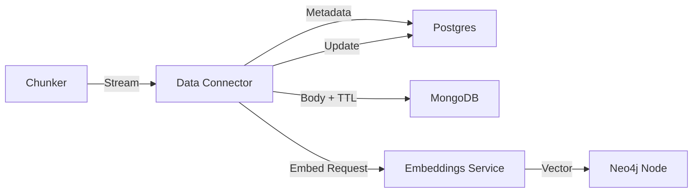

# Chunk Retention Policy

## Overview

ConHub uses an **ephemeral-first** approach to chunk storage. This minimizes long-term storage costs while maintaining the ability to debug and reprocess within a configurable time window.

## Storage Modes

Configure via `CHUNK_STORE_MODE` environment variable:

| Mode | Description | Body Storage | Use Case |
|------|-------------|--------------|----------|
| `ephemeral` | Stream-only, no persistence | None | Production (minimal storage) |
| `mongo-ttl` | MongoDB with TTL auto-deletion | MongoDB (TTL) | Debug-enabled production |
| `postgres` | Full persistence in DB | Postgres | Development/Testing |

## Configuration

```bash
# Chunk storage mode
CHUNK_STORE_MODE=mongo-ttl

# Time-to-live for chunk bodies (only applies to mongo-ttl mode)
CHUNK_TTL_DAYS=7

# MongoDB connection (only needed for mongo-ttl mode)
MONGODB_URI=mongodb://localhost:27017/conhub_chunks
```

## What Gets Stored Where

### Postgres (Always)
Minimal metadata for all chunks:
- `id` - Chunk UUID
- `tenant_id` - Tenant identifier
- `source_id` - Parent connector/file reference
- `content_hash` - SHA-256 hash for deduplication
- `neo4j_id` - Reference to Neo4j node (contains vector)
- `embedding_state` - Processing status: pending/processing/embedded/failed
- `content_summary` - Optional LLM-generated summary
- `created_at` - Timestamp

### Neo4j (Always)
- Graph node with embedding vector
- Source relationships (document → chunk → entity)
- Cross-source semantic links

### MongoDB (TTL Mode Only)
- Full chunk body text
- `purge_at` timestamp (auto-deleted after TTL)
- Indexed by `chunk_id`

## Data Flow



## Reprocessing

If reprocessing is needed (new embedding model, etc.):

1. **Within TTL window**: Read body from MongoDB, re-embed
2. **After TTL expires**: Re-fetch from source connector, re-chunk, re-embed

## Cleanup

A background worker handles:
- Stale MongoDB document cleanup (backup for TTL index)
- Tenant retirement (bulk delete on tenant removal)
- Orphaned chunk cleanup (missing Neo4j references)

Run manually: `python -m tools.cleanup_worker`
